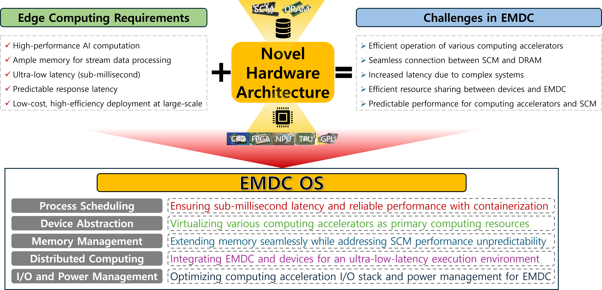

# Research on Edge-Native Operating Systems for Edge Micro-Data-Centers

<h3> 

English&nbsp;&nbsp;&nbsp;|&nbsp;&nbsp;&nbsp;[한국어](./README_ko.md)&nbsp;&nbsp;&nbsp; 

</h3>

## Project Goal
This study investigates a novel operating system architecture that incorporates the characteristics of next-generation computing accelerators and SCM, aiming to efficiently process intelligent computing tasks on data streams delivered from edge devices at edge-micro data centers. Based on this architecture, we develop an **edge-friendly operating system**.

## Repository Lists

| No. | Name | Description |
|:---:|:----:| ------------|
|1|[bidirectional-readahead](https://github.com/EMDC-OS/Bidirectional-Readahead)| Linux kernel for Bidirectional Readahead |
|2|[CorePartitioning](https://github.com/EMDC-OS/CorePartitioning)|A core-partitioning library and kernel module designed to improving I/O performance|
|3|[CXL-AutoNUMA](https://github.com/EMDC-OS/CXL-AutoNUMA)|Implementation of a dynamic hot-page management technique to support large-scale tenants in EMDC|
|4|[EMDC_llvm](https://github.com/arcs-skku/EMDC_llvm)|A utility that provides transparency and dynamic rebinding for heterogeneous accelerators on EMDCs|
|5|[gpu-faas](https://github.com/EMDC-OS/gpu-faas)|A serverless computing platform that minimizes start-up latency for accelerator-based applications by sharing accelerator contexts and thus eliminating context initialization time|
|6|[inference_profiler](https://github.com/EMDC-OS/inference_profiler)|A profiler that can capture the full stack (from the inference layer to the OS kernel) for inference workloads using the NVIDIA Triton Inference Server|
|7|[KuScale](https://github.com/sslab-konkuk/KuScale)|A scheduler that ensures low latency and provides fine-grained control of GPUs|
|8|[linux-autozg](https://github.com/jungyun-choi/linux-autozg)|A performance optimization technique for ZNS SSDs using dynamic zone group management in F2FS (SYSTOR '24)|
|9|[mg-lru](https://github.com/EMDC-OS/mg-lru)|A script that analyzes the kernel memory management layer for high-latency I/O requests occurring during read/write operations in low-memory environments (ICCD '23)|
|10|[pm-aware-scheduler](https://github.com/EMDC-OS/pm-aware-scheduler)|A dynamic workload relocation technique that takes SCM I/O awareness into account in NUMA environments|
|11|[pm-opzero](https://github.com/EMDC-OS/pm-opzero)|A filesystem that eliminates the data-initialization (zero-out) overhead caused by removing the page cache in DAX|
|12|[power-aware-trition](https://github.com/EMDC-OS/power-aware-triton)|“A power management technique incorporating inference energy consumption characteristics in a single-GPU node build on the NVIDIA Triton Inference Server (HPCA '23)|
|13|[remote-io](https://github.com/EMDC-OS/remote-io.git)|A direct access extension model for Remote I/O in the Linux kernel|
|14|[remote-swap](https://github.com/EMDC-OS/remote-swap)|Code that expands memory and improves application switching performance in mobile systems by leveraging the abundant storage resources of edge servers|
|15|[severless-rewind](https://github.com/EMDC-OS/serverless-rewind)|A technique to address security issues arising from function execution in a serverless edge cloud environment while simultaneously optimizing execution performance (USENIX ATC '24)|
|16|[usbip-COMPRESS](https://github.com/EMDC-OS/usbip-COMPRESS)|An efficient data transfer implementation based on direct transmit/receive at the kernel layer|